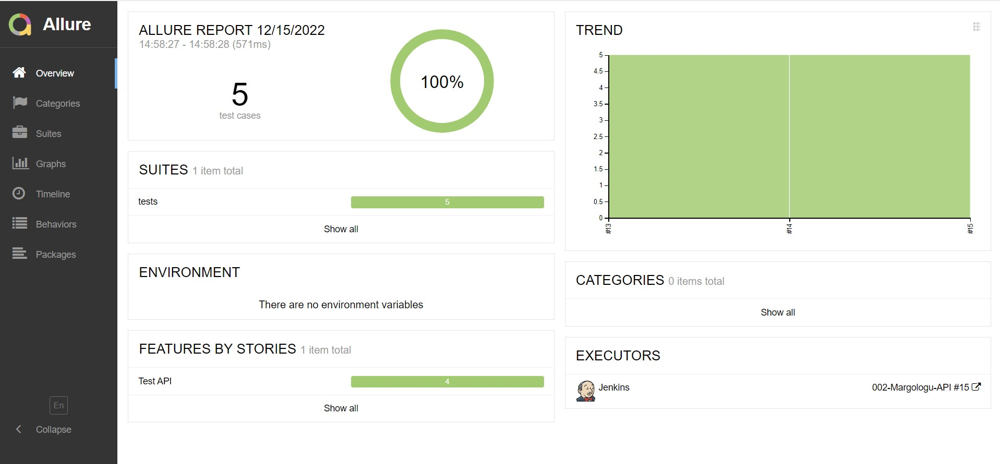
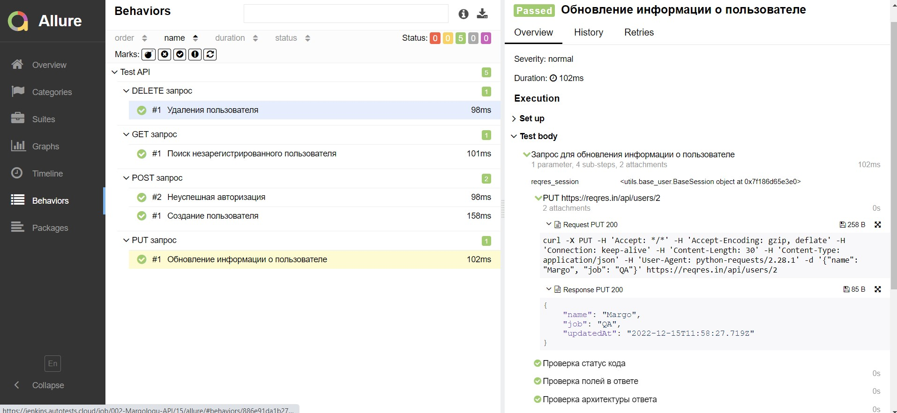
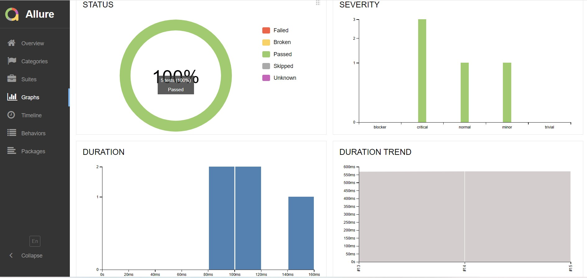
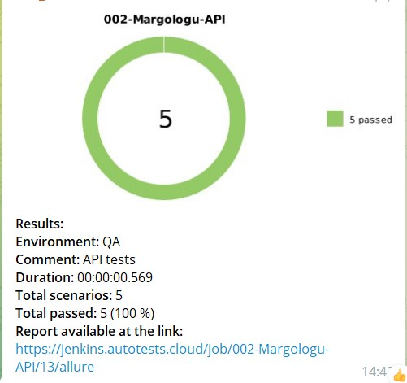

# Проект автоматизации API тестирования для <a target="_blank" href="https://reqres.in/">reqres.in</a>

## :open_book: Содержание:
- [Технологии и инструменты](#gear-в-проекте-используются-следующие-технологии-и-инструменты)
- [Что проверяем](#heavy_check_mark-что-проверяем)
- [Запуск тестов из Jenkins](#-запуск-тестов-из-jenkins)
- [Отчеты](#bar_chart-отчеты-о-прохождении-тестов-доступны-в-allure)
- - [Allure](#-allure)
- - [Telegram](#-telegram)
- [Allure TestOps](#-проект-интегрирован-с-allure-testOps)

## :gear: В проекте используются следующие технологии и инструменты:

## :heavy_check_mark: Описание
В проекте автоматизирована проверка API запросов на сайте reqres.in.

## :heavy_check_mark: Что проверяем

> - Создание пользователя;
> - Обновление информации о пользователе;
> - Поиск незарегистрированного пользователя;
> - Удаления пользователя;
> - Неуспешная авторизация.

## Сборка в [Jenkins](https://github.com/Margolog/diplom_API)

  

## Информация о тестах в [Allure report](https://jenkins.autotests.cloud/job/002-Margologu-API/15/allure/#behaviors/cec508300776df9409898493af0c7156/8839c33da7136177/)

  

### Окно с кейсами

  

#### Графики

  

## Интеграция с [Allure TestOps](----)

### Тест-кейсы

  

### Дашборд

  

## Интеграция с [Jira](https://jira.autotests.cloud/browse/HOMEWORK-470)

  

## Уведомление в Telegram

  

